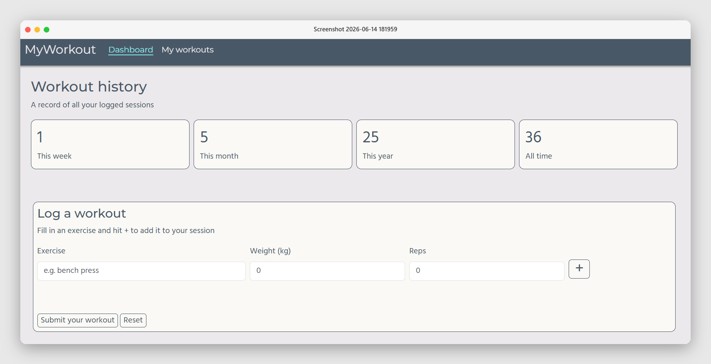
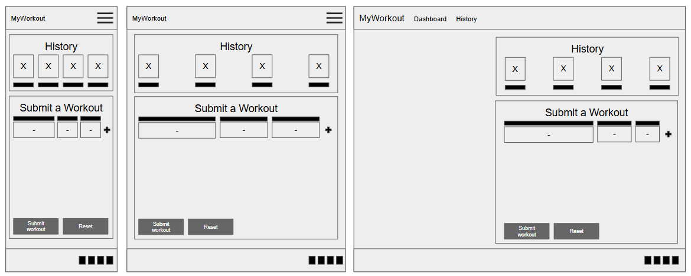
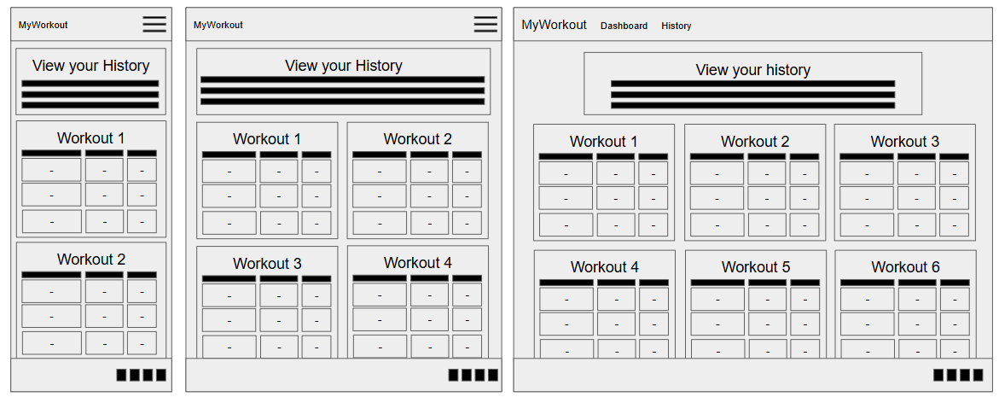
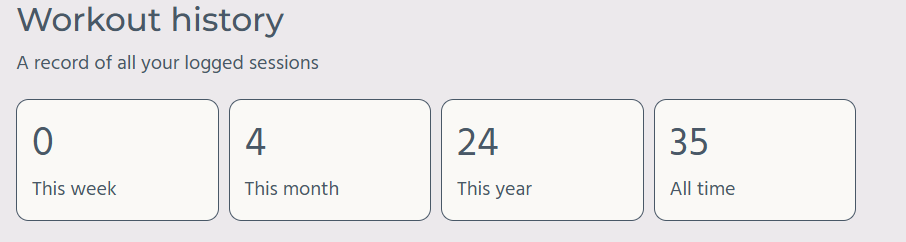
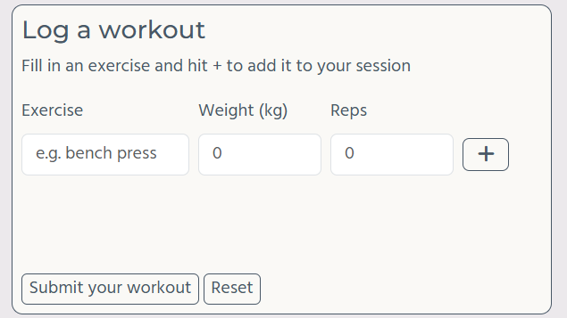
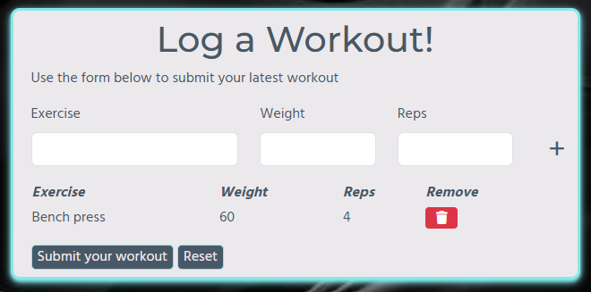
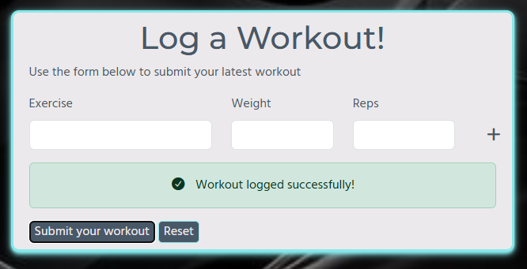
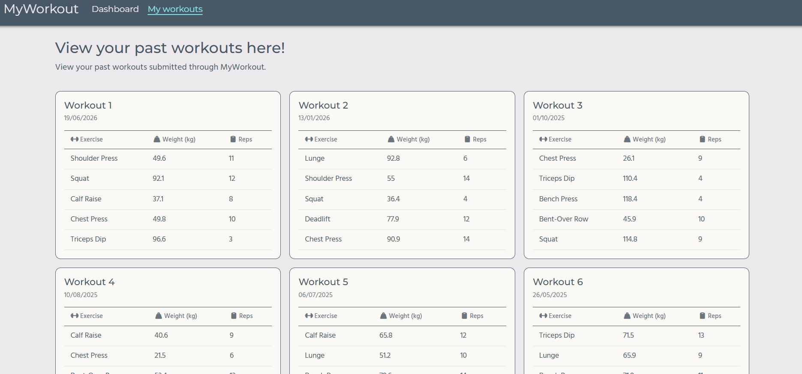
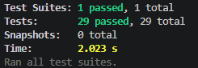

# Project 2: MyWokrout
A website that allows users to add their workouts and track their progress. 

## Table of Contents 

[Project Goals](#project-goals)
> [User Goals](#user-goals)
>
> [Site Goals](#site-goals)
>
[User Experience](#user-experience)
>
>[Target Audience](#target-audience)
>
>[Expectations](#expectations)
>
>[User Stories](#user-stories)
>
[Design](#design)
>
>[Fonts, Colours & Structure](#colours)
>
>[Wireframes](#wireframes)
>
[Frameworks & Languages](#frameworks)
>
[Features](#features)
>
>[Common Features](#common-features)
>
>[Dashboard](#dashboards-section)
>
>[My Workouts](#my-workouts)
>
[Testing](#testing)
>
>[User Story Testing](#user-story-testing)
>
>[HTML Testing](#html)
>
>[CSS Testing](#css)
>
>[Javascript Testing](#javascript)
>
[Bugs](#bugs)
>
[Deployment](#deployment)
>
[Code Used from External Sources](#external)
>
[Credits](#credits)

## Project Goals
This web application allows a user to track their workouts that they would undertake at the gym and track their progress. A user can use the dashboard page to input their workout and submit this to be added to their statistics. 

### User Goals
Users have the following goals: 
* Add in their workout stats
* View how many workouts they have done in the past week, month, year and overall
* Look at recent exercises they have done
* Track previous workouts they have submitted

### Site Goals
Site managers hae the following goals: 
* build a database of workouts 
* look at statistics of common exercises

## User Expereince 
This section shows the considerations for each type of user that would use the website and the exeriences they would have.

### Target Audience
The target audience is any user that wants to track their workouts over a period of time. 

### Expectations
Users of the site can expect:
* Easy to use navigation
* Clear layout
* Links to everything described
* Responsiveness to view the site on any device

### User Stories
The following user stories have been considered:

**User 1: Workout Logging**
This user should expect to: 

* Add each exercise of their workout
* Submit their exercises
* See confirmation of their workout submission
* View how many workouts they have done over different time periods

**User 2: Workout Tracking**
This user should expect to:

* See previously submitted workouts
* Ordered an a navigatable way

## Design
This section shows the design choices I made as part of the design of this website, alongside wireframes to show the rough layout of each page before construction of the website. Through all these choices, I have considered the 5 planes of user experience to ensure a smooth and enjoyable experience for all users of the site. 

### Fonts, Colours and Structure
The colour theme of this site is as follows:

|Colour|Hex Code|Description   |
|:-----|:-------|:-------------|
|Electric Aqua  |#86E8EA |Primary Colour|
|Platinum|#ECE9EC |Primary Background Colour|
|Blue Slate|#495867 |Secondary Colour|
|Oxidised Iron|#B02E0C|Secondary Background Colour|
|Yellow Green|#B0D50B|Secondary Background Colour|

Using this [contrast evaluator](https://coolors.co/contrast-checker/495867-ece9ec), the two most paired colours have scores 6.06 (#495867 and #ECE9EC) and 6.94 (#495867 and #FAF9F6) respectively.

There are two fonts used through this site:

1. Hind is the primary font used for main bodies of text
2. Monserrat is the secondary font and is used for headers and important bits of text

The site will have an easy to follow structure with a standardised navigation bar across all pages to allow users to find the information they need. This web application consists of two pages.

1. A home page (labeled My Dashboard) allowing users to submit their workouts and view key statistics
2. A page showing previous workouts

### Wireframes
This section shows the wireframes for each page created in this website, across small, medium and large screens from left to right.

#### Dashboard

#### History

## Frameworks & Languages
This section highlights all the langauges and frameworks used in this seciton.

The following languages are used in this project:

* HTML
* CSS
* JavaScript

The following frameworks are used in this project: 

* Bootstrap v5.3.8
* Github
* Google Fonts
* Font Awesome
* JQuery
* JEST

## Features
This section outlines the key features on each page. 

### Common Features
Common features across all pages on this site include the navigate bar and the footer. 

#### Navigation Bar
The navigation bar is featured on all pages, and aims to:

* Consistant styling and position for each of use 
* Responsive design across small, medium and large screens

#### Footer
The footer is featured across all pages, and aims to:

* provide links to common social media sites 

### Dashboard
The dashboard page as two key sections which cover a number of features:

#### Feature 1: Workout Counting
**What this does:**
This feature shows the number of workouts that would currently be logged on the website in the last week, last month, last year and all time. In this case, the orignal numbers when the page loads are hard coded as there is no back end storage for this site.

**How it works:** 
Once a user inputs a workout using features 2-4, the data is logged as an object and an iteration calculation updates each number. 

**User Stories:**
This satisfies User 1. 

#### Feature 2: Workout Input
**What this does:**
This feature allows the user to add in the name of an exercise, the weight in kilograms and the number of reps for each workout. Once satisfied, users can hit the plus to add this data to a table to view.

**How it works:** 
This uses a standard HTML input form with a text input and two numerical inputs. Javascript is used to take the form inputs and add them to a table which is invisible until the first submission.

**User Stories:**
This satisfies User 1.

#### Feature 3: Workout Logging
**What this does:**
This features shows the data which the user has already submitted. The user can add as many rows as they please. If a user has made an error, they can use the red icon in the remove column to remove the row and reinput the correct information using the form again. 

**How it works:** 
This uses Javascript functions to add an event listener to record when the red remove icon is clicked to remove a row or when the form submission icon is clicked to add the row.

**User Stories:**
This satisfies User 1.

#### Feature 4: Workout Submission
**What this does:**
This feature takes all the rows of the table and creates an object with the submission date and the inputted information. This also increases the counts in Feature 1. Once submitted, a success message appears to asure users that this is recorded. Users can then use the reset button to submit another workout. 

**How it works:** 
This users a mixture of event listeners and functions to ensure the object is logged. Functions ensure this can be reset and multiple workotus can be submitted as objects and the count can keep increasing. 

**User Stories:**
This satisfies User 1. 

### My Workouts
The 'My Workouts' page has one main feature:

#### Feature 5: Historic Workouts
**What this does:**
Displays past workouts. In this case, the workouts are randomly generated with a date from 1st January 2024 to present day from a list of 10 exercises as there is no back end storage. These are ordered fom most recent to least recent.

**How it works:** 
Using a script, we generate 15 objects containing a randomised date, 5 exercises with weight and reps for each. Then we generate a card for each object and add these to the DOM to be displayed for the user. 

**User Stories:**
This satisfies User 2.

## Testing
I have tested the HTML, CSS and Javascript used within this project using a variety of tools. Each section will explain how this is done. 

### User Story Testing
Each of the following user stories outlined at the beginning of this document are covered here: 

|User|User Story|Testing   |
|:-----|:-------|:-------------|
|User 1|Add each exercise of their workout|There is a form to submit an exercise of a workout|
|User 1|Submit their exercises|Using the 'submit your workout' button, a user can add their workout to the site|
|User 1|See confirmation of their workout submission|Upon clicking the 'submit your workout' button, a success message should appear and an error pop up if you have not added any exercises|
|User 1|View how many workouts they have done over different time periods|The workout history at the top of the page provides numbers that update as you submit more workouts|
|User 2|See previously submitted workouts|Using the My Workouts page, a user can see previous workouts|
|User 2|Past workouts ordered in a navigatable way|Workouts on the My Workouts page follow the same design as the first page and are arranged in date order|

### HTML
Using the [HTML Validator](https://validator.w3.org/), I received no errors for index.html and one warning in myworkouts.html. This warning is due to headings not being in a correct heirachy but this code is generated by javascript.

### CSS
Using the [Autofixer](https://autoprefixer.github.io/), I have ensured my CSS is complient with all browser types. 

Using the [CSS Validator](https://jigsaw.w3.org/css-validator/), I have no recorded errors and 31 warnings due to the variables not statically checked. 

### JavaScript
In this document, I have two Javascript files to provide code for each of my web pages. For index.html, I used the JEST testing framework to ensure this was working, as well as manual testing. I chose to use JEST for index.html, as their are multiple functions interacting to ensure the user has the expected functionality. This also allows me to check when alerts should appear for when users do not present all information required for submission. For myworkouts.html, I manually tested this as I did not deem automated testing necessary for the simplier code and the lack of cuntions. . 

For index.html, I ran 29 tests to ensure the functionality of my webpage. The outcome can be seen in the image below. 

These tests are broken down into 7 describe blocks which cover the following: 

|ID|Describe Block|Tests   |
|:-----|:-------|:-------------|
|1|getFormValues()|<ul><li>Takes form inputs correctly</li><li>Trims whitespace from inputs</li><li>Returns empty strings when fields are blank</li></ul>|
|2|isValid()|<ul><li>Returns truthy when all three fields are populated</li><li>Returns falsy when exercise is missing</li><li>Returns falsy when weight is missing</li><li>Returns falsy when reps is missing</li><li>Returns falsy when all fields are empty</li></ul>|
|3|addTableRow()|<ul><li>Returns a tr element</li><li>Renders exercise, weight, and reps in the correct cells</li><li>Includes a remove button with the btn-danger class</li></ul>|
|4|Form submit event|<ul><li>Adds a row to the table on valid submission</li><li>Makes the table visible on first valid submission</li><li>Resets all form fields after submission</li><li>Does not add a row when fields are empty</li><li>Accumulates multiple rows correctly across repeated submissions</li></ul>|
|5|Row remove button|<ul><li>Removes the correct row when the trash button is clicked</li><li>Re-hides the table when the last row is removed</li><li>Only removes the targeted row leaving other rows intact</li></ul>|
|6|Overall submit button|<ul><li>Shows a success alert when at least one exercise exists</li><li>Replaces the table with the success message on submit</li><li>Does not show a success message when the table is empty</li><li>Increments all four counters on submission</li><li>Does not increment counters when the table is empty</li></ul>|
|7|increaseCount()|<ul><li>Increments an elements text content by 1</li><li>Correctly increments from 0</li></ul>|
|8|Reset button|<ul><li>Restores the original table structure after a successful submit</li><li>Restored table has the invisible class with no leftover rows</li><li>Removes the success alert on reset</li></ul>|

For myworkouts.html, upon page load, 15 workouts generate in date order based on the random generator made using JavaScript. This was expected and upon refresh the 15 workouts appear again with a different randomisation of the array and dates.  

## Bugs
The following bugs occured during the design of this site: 

|ID|Bug|Fix   |
|:-----|:-------|:-------------|
|1|Table was not spaced properly on first page|Changed table width to 100%|
|2|Form spacing would not work |Amended the bootstrap columns to ensure the plus fits on all screen sizes|
|3|Date was undefined on My Workouts page|Typo in call for date|
|4|On success the table to collect the form entries would not reappear|Added in a new function to add the code for the invisible table after clicking reset|
|5|Didnt add multiple objects to the recordings|Workouts were stored in an array|
|6|Upon clicking reset, you could not submit another form|Table and Tbody constants became functions that store values at the page load|
|7|Padding did not get added horizontally for history cards|Introduced a separate div for the cards on the histroy page|

## Deployment
This website is deployed using GitHub Pages by using the following method: 

1. Open up the github repository
2. Navigate to the Settings tab
3. Select the pages option in the 'Code and Automation' section
4. For the source choose 'deploy from branch'
5. For branch, choose main
6. After the webpage refreshes, the ribbon will say "Your site is live at https://mturner1158.github.io/myWorkout-project-2/"

## Code from External Sources
All code in this project is my own. I have used Claude Sonnet 4.6 to help troubleshoot Jest testing. 

## Credits and Disclaimer
I have the following credits and disclaimers: 

* Thank you to my friends for helping to test application functionaltiy 
* Credit to flaticon for the favicon 